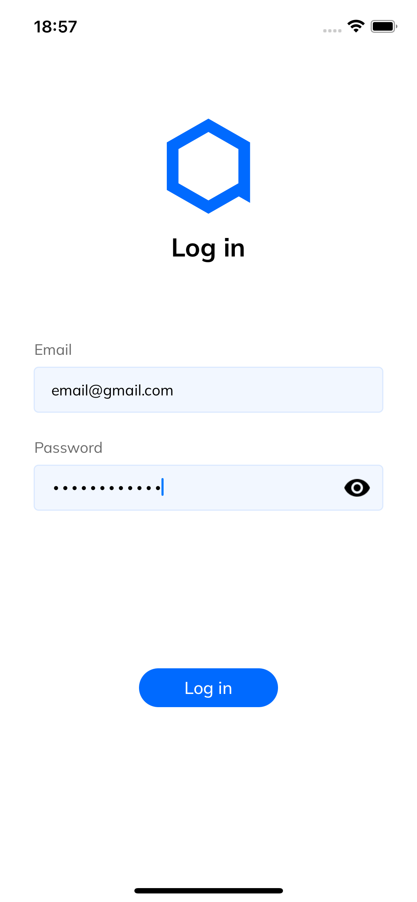
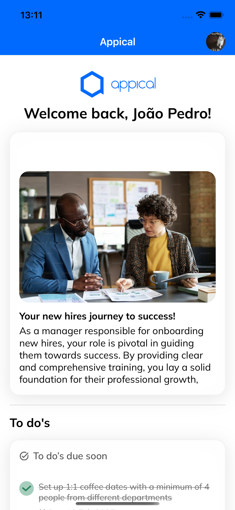
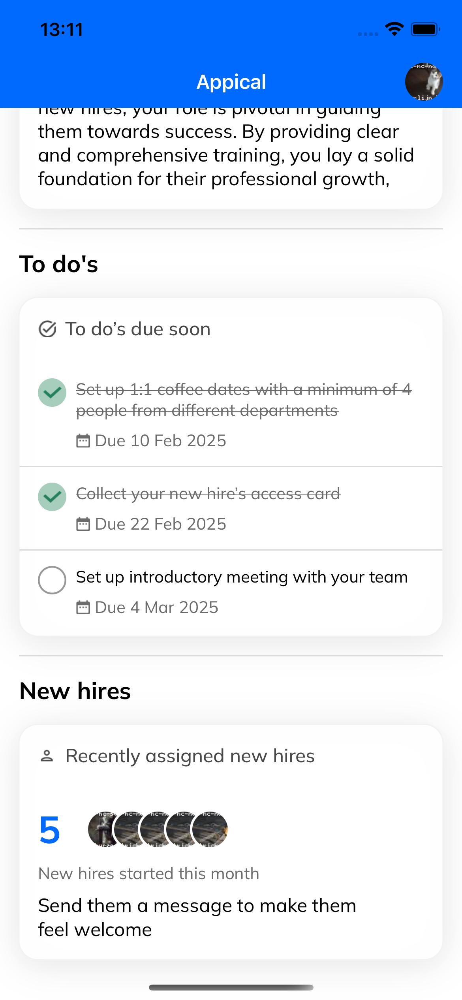
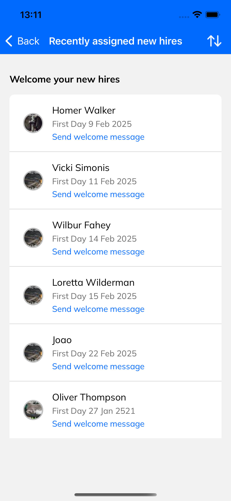

# JAppical

_The `J` suffix denotes that this is an in-house solution tailored for our specific needs._

|  |  |  |  |
|---------------------|---------------------|---------------------|---------------------|

### Setup

- **Xcode Version:** 13.4.1. _My personal MacBook does not support later versions. MacOS Monterey 12.7_
- **Minimum iOS Version:** 15.5 for the main target and packages.
- **Device Support:** Supports iPhone only, in portrait mode, as a landscape view is impractical for this use case.

#### Steps

1. Clone the project `git@github.com:joaopedroffranco/JAppical.git`.
2. Open the `JAppical.xcworkspace`.
3. Resolve the SPM Packages and run the main target `JAppical`. 
4. Log in using email: `email@gmail.com`, password: `password1234`

_There are tests for `JAppical` and `JData` targets._

### Technology Stack

- **UI Implementation:** Built using `SwiftUI` for ease of UI development.  
- **ViewModel Architecture:** Implemented with `Combine` to enable reactive binding between views and enhance responsiveness.  
- **Code Documentation:** Each file (mainly domain ones) is well-documented with detailed comments.  
- **Tests:** Each view model and data layer is tested with diverse scenarios to ensure reliability and performance.  
- **Persistence:** The models are persisted using `Realm`, as it is easier than `CoreData` and well-documented. The user is able to navigate offline.
- **Concurrency:** The async task are handle by the new `Swift Concurrency`.

### Frameworks

To ensure modularity, separation of concerns, and improved build times, the project is structured as follows:

- **JFoundation:** Contains shareable utilities and extensions.  
- **JUI:** Implements the design system and UI components.  
- **JData:** Manages network integration and data handling.  
- **JAppical:** The main bundle housing primary features:  
  - **Dashboard:** Displays the initial information about the user, including to-do tasks and the current month's hires.  
    - **TodoTasks:** Displays the to-do tasks.  
  - **NewHires:** Displays the complete information about the new hires.  
  - **Login:** Displays the authentication flow.  

**Package Management:** Utilizes `Swift Package Manager` for managing local frameworks, providing a straightforward integration process.

### API

The API is [`https://mockapi.io/projects/67a5f0ca510789ef0df9d15a`](https://mockapi.io/projects/67a5f0ca510789ef0df9d15a).

_The free plan allows adding only up to two resources. So, I've built an API focused on New Hires and Tasks. The authentication is fake, and credentials are fetched from `UserDefaults`._

#### Endpoints:
- **`GET /new_hires`**: Retrieves all new hires data.  
- **`GET /tasks`**: Retrieves all to-do tasks data (simulating that these are the tasks assigned to a given user).  
- **`PUT /tasks/$id`**: Updates a task given its `id` (used to mark it as done, for instance).  

### Feature Highlights

#### Main Design Pattern

As mentioned, it follows the MVVM pattern, adhering to SwiftUI conventions.

- The view is as simple as possible.
- Complex views are split into smaller subviews. They also may contain a view data to centralize visual rules and formatting.
- Each view is associated with a view model.
- The view model handles the services and managers.
- The services integrate with remote data sources and storages.
- The data sources and storages fetch and handle the models.

#### Todo Tasks

**When fetching the tasks:**  
1. It syncs the tasks that are `isRemoteUpdated = false`, updating them on the remote.  
    1.1. If successful, they are tagged as `isRemoteUpdated = true`.  
2. Then, it fetches the array of `TodoTask` from the remote.  
    2.1. If successful, it saves them in the cache and returns.  
    2.2. If it fails, it fetches from the cache and returns.  

**When marking a task as done:**  
1. It marks the task in the cache (to return faster).  
2. Asynchronously, it updates the task on the remote.  
    2.1. If it fails, the task is tagged as `isRemoteUpdated = false` in the cache. 

#### New Hires

**When fetching this month's hires:**  
1. It fetches the array of all `NewHire` records from the remote.  
    1.1. If successful, it saves them in the cache.  
    1.2. If it fails, it fetches from the cache.  
2. It returns only the hires for the current month.  

**When fetching all new hires:**  
1. It fetches the array of all `NewHire` records from the cache, as they have been saved previously.  
    1.1. If successful, it returns them.  
    1.2. If it fails, it fetches from the remote and returns.

#### Login

_Reinforcing, the authentication is fake, and credentials are fetched from `UserDefaults`. The `AuthenticationService` wraps this logic. If a secure API is provided (e.g., OAuth), it is just a matter of updating this service layer._

1. It displays the email input.  
   1.1. If the user inputs an invalid email, it shows an error message.  
2. When the user taps `Next`, it checks if the email exists.  
   2.1. If it doesn't exist, it shows an error message.  
3. It displays the password input.  
4. When the user taps `Log in`, it authenticates.  
   4.1. If the password is incorrect, it shows an error message.  
   4.2. If authentication is successful, it updates the singleton `AuthenticationManager` and navigates to `DashboardScreen`.  
5. The user is saved in `UserDefaults` and can automatically authenticate in future sessions.  
   5.1. The user is able to log out from `DashboardScreen`.